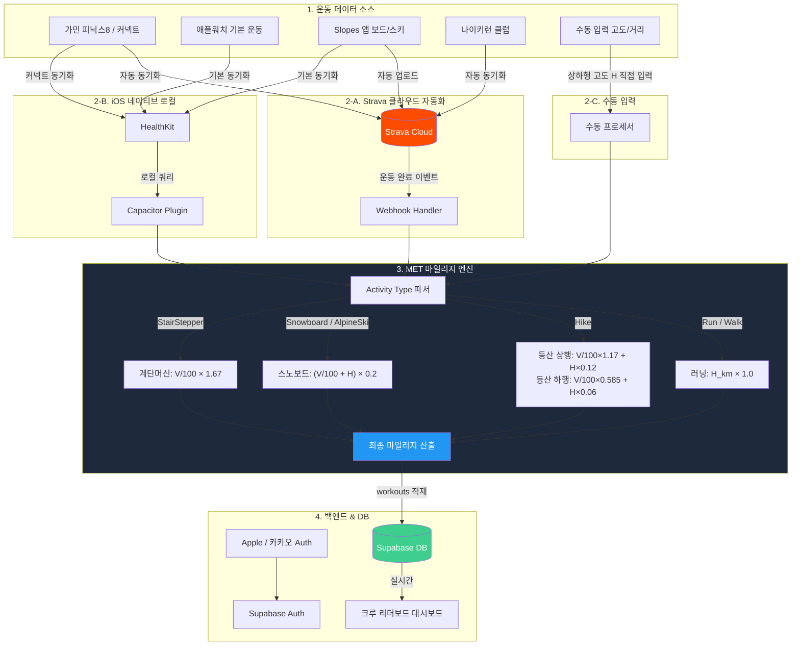

# 🗺️ Cardio 통합 기술 & 기능 로드맵 v0.3

---

## 📌 Phase 1: 인프라 안정화 & 등산 고도화 (현재 ~ Short-term)

> "회원 100명의 수기 입력 피로도를 즉시 낮추고, 수동 입력 기반으로 등산 공식을 먼저 검증하는 단계"

### 기능 (Feature)

- **등산 상행/하행 분리 UI 구현**: 입력 폼에서 획득 고도(상행)와 하강 고도(하행)를 분리 수집
- **MET 기반 마일리지 엔진 배포**: 수동 입력값에 아래 공식 적용 후 자동 연산 및 workouts 적재
- **반자동 인증 팝업 (플랜B)**: Strava 심사 지연 대비, 가민/나이키런 스크린샷 → OCR → 자동 매핑 UI

### 인프라 (Tech Infrastructure)

- **Strava API Production 승인 획득**: 데모 로그인 유지하며 하루 30,000 요청 확보
- **Strava Webhook 파이프라인**: 운동 완료 시 앱 실행 없이 자동 DB 동기화 (Polling 원천 차단)

---

## 📌 Phase 2: Strava 연동 및 겨울 시즌 준비 (Mid-term)

> "자동화 엔진 최초 도입. Strava 생태계를 통해 스노보드/스키 데이터까지 흡수하는 단계"

### 기능 (Feature)

- **Strava Activity Type 매핑 확장**: `Snowboard`, `AlpineSki`, `BackcountrySki` 파싱 엔진 가동
- **스노보드 마일리지 엔진**: V+H 기반 공식 적용, `total_elevation_loss` + `distance` 필드 사용
- **스노보드 핵심 스탯 카드 UI**: 버티컬 드롭(m), 최고 속도(km/h) 메인의 보더 전용 카드

### 인프라 (Tech Infrastructure)

- **Backfill 최적화**: 신규 연동 시 최근 2주 데이터만 수집, 하루 3만 쿼터 방어
- **크루별 계수 커스텀 페이지**: 클럽 방장이 등산/보드/보강운동 계수를 직접 조정하는 관리자 화면

---

## 📌 Phase 3: iOS Capacitor 네이티브 진화 (Long-term)

> "iOS 기준으로 시스템 그릇을 키우고, 알림과 로컬 건강 데이터까지 확장하는 완전체 단계"

### 기능 (Feature)

- **백컨트리 하이크업 완전 연동**: `BackcountrySki` 데이터를 등산 상행 공식과 결합, 복합 마일리지 자동 산정
- **푸시 알림**: 마일리지 적립 / 순위 변동 시 크루원에게 알림 발송
- **iOS HealthKit 파이프라인**: Strava 없이 애플워치 기본 앱 또는 Slopes 단독 사용자 데이터 직접 수집

### 인프라 (Tech Infrastructure)

- **Apple Sign-In 구현**: 스토어 출시 필수 조건, 기존 카카오 유저 매핑 최적화
- **iOS Capacitor 래핑 & APNs 연동**: Xcode 빌드, App Store 공식 출시 (V1.0.0)
- **Live Update 시스템**: git push만으로 스토어 심사 없이 실시간 반영

---

## ⚖️ MET 기반 등가 마일리지 공식

> 계단머신(MET 10, 계수 1.67)을 기준점으로 모든 계수 도출: `계수 = 1.67 × (MET / 10)`
> 러닝처럼 시간 무관 — V(수직)와 H(수평)의 달성량만으로 계산

### 공식 일람

| 액티비티 | MET | 공식 | 비고 |
|---------|-----|------|------|
| 러닝 | 9.8 | `H_km × 1.0` | 기준점 (10km = 10마일) |
| 계단머신 | 10 | `V_m/100 × 1.67` | 층수 × 3m = V |
| 등산 상행 | 7 | `V_m/100 × 1.17 + H_km × 0.12` | |
| 등산 하행 | 3.5 | `V_m/100 × 0.585 + H_km × 0.06` | |
| 스노보드 하강 | — | `(V_m/100 + H_km) × 0.2` | 리프트 시간 비포함 특성상 경험적 계수 |

### 검증 시뮬레이션

| 상황 | 계산 | 마일리지 |
|------|------|---------|
| 러닝 10km | 10 × 1.0 | **10** |
| 계단머신 100층 (300m) | 3 × 1.67 | **5** |
| 설악산 상행 (V=1400m, H=7.5km) | 16.4 + 0.9 | **17.3** |
| 설악산 하행 (V=1400m, H=7.5km) | 8.2 + 0.5 | **8.6** |
| 설악산 왕복 합계 | 17.3 + 8.6 | **25.9** (하프마라톤 이상) |
| 스노보드 실측 (V=5529m, H=24.2km) | (55.3 + 24.2) × 0.2 | **15.9** |
| 스노보드 중급자 하루 (V=4000m, H=20km) | (40 + 20) × 0.2 | **12.0** |

### Strava 자동 처리

대부분의 한국 등산은 왕복 구조 → V상행 ≈ V하행, H도 절반씩. 공식 합산:

```
등산 마일리지 (자동) = V_m/100 × 0.8 + H_km × 0.4
```

> `total_elevation_gain` (V), `distance` (H) 필드만으로 자동 계산 가능

---

## 🏗️ Cardio 데이터 & 서비스 구조도



---

## Mermaid 보는 법

| 환경 | 방법 |
|------|------|
| **VS Code** | `Mermaid Preview` 확장 설치 → `.md` 파일에서 우클릭 → Preview |
| **GitHub** | `.md` 파일에 코드블록으로 넣으면 자동 렌더링 |
| **온라인** | [mermaid.live](https://mermaid.live) 에 코드 붙여넣기 |
| **JetBrains** | 기본 내장 (Markdown 미리보기에서 자동 렌더) |

VS Code라면 `Mermaid Preview` (by Tomoyuki Aota) 확장 하나만 설치하면 됨.
